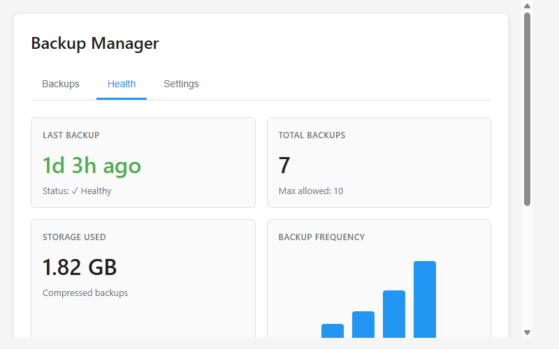
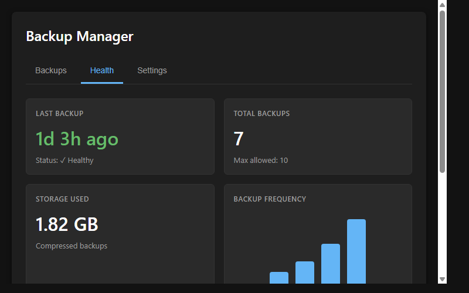

# Home Assistant Backup Manager

[](https://github.com/MacSiem/ha-backup-manager/actions/workflows/validate.yml)
[](https://github.com/hacs/integration)

A Lovelace card for Home Assistant that lets you manage, monitor, and analyze your backups directly from your dashboard. Create full or partial backups, track backup health, and view storage usage with an intuitive interface.



## Features

- Create full and partial backups with a single click
- Browse all backups with detailed information (type, size, date, protection status)
- View backup contents (Home Assistant config, database, add-ons, folders)
- Health monitoring dashboard with backup frequency charts
- Track days since last backup with color-coded status indicators
- Storage usage visualization and backup count tracking
- Automatic backup schedule information
- Search and filter capabilities
- Light and dark theme support

## Installation

### HACS (Recommended)

1. Open HACS in your Home Assistant
2. Go to Frontend → Explore & Download Repositories
3. Search for "Backup Manager"
4. Click Download

### Manual

1. Download `ha-backup-manager.js` from the [latest release](https://github.com/MacSiem/ha-backup-manager/releases/latest)
2. Copy it to `/config/www/ha-backup-manager.js`
3. Add the resource in Settings → Dashboards → Resources:
   - URL: `/local/ha-backup-manager.js`
   - Type: JavaScript Module

## Usage

Add the card to your dashboard:

```yaml
type: custom:ha-backup-manager
title: Backup Manager
warn_after_days: 3
max_backups: 10
```

### Configuration

| Option | Type | Default | Description |
|--------|------|---------|-------------|
| `title` | string | `Backup Manager` | Card title |
| `warn_after_days` | number | `3` | Days before showing warning status |
| `max_backups` | number | `10` | Maximum number of backups to keep |

## Screenshots

| Light Theme | Dark Theme |
|:-----------:|:----------:|
|  |  |

## How It Works

The card uses Home Assistant's WebSocket API to fetch and manage backups. The **Backups tab** displays all available backups with filtering and content inspection. The **Health tab** provides at-a-glance monitoring with backup frequency charts and storage usage. The **Settings tab** shows your current configuration.

Features include:
- **Full Backup Creation**: Complete system backup including all add-ons and configurations
- **Partial Backup Creation**: Selective backup of specific components
- **Health Monitoring**: Track backup frequency, storage usage, and warning statuses
- **Backup Details**: Inspect what each backup contains (configs, database, add-ons, folders)
- **Protection Status**: See which backups are password-protected

## License

MIT License - see [LICENSE](LICENSE) file.
