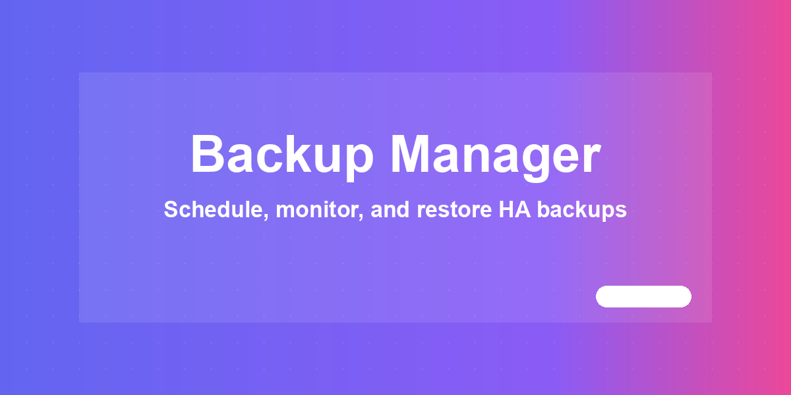

# 💾 Backup Manager — DEPRECATED

> ## ⚠️ This repo is deprecated and will be archived
>
> **Why:** Home Assistant ships a full backups manager natively under
> **Settings → System → Backups** (create, restore, schedule, retention) since
> the 2024.x release line. Maintaining a 1.8 kLOC HACS duplicate no longer makes sense.
>
> **HACS status:** [PR #6259](https://github.com/hacs/default/pull/6259) was closed by HACS reviewers for the same reason — duplicates native HA functionality.
>
> **What to use instead:** open HA → **Settings → System → Backups** (or `/config/backups`).
>
> Existing installs will continue to work as-is, but no further updates will be published.



Create, restore, monitor and schedule Home Assistant backups.

[](https://www.home-assistant.io/) [](LICENSE) [](#changelog)

> Part of the [HA Tools](https://github.com/MacSiem) ecosystem — split into individual HACS-installable plugins.

## Installation (HACS)

1. Open HACS → Frontend → ⋮ → **Custom repositories**
2. Repository URL: `https://github.com/MacSiem/ha-backup-manager` — Category: **Lovelace**
3. Install **Backup Manager** from HACS
4. Restart Home Assistant

## Usage

### Lovelace card

```yaml
type: custom:ha-backup-manager
```

### Optional sidebar panel (`configuration.yaml`)

```yaml
panel_custom:
  - name: ha-backup-manager
    sidebar_title: Backup Manager
    sidebar_icon: mdi:home-assistant
    url_path: ha-backup-manager
    js_url: /local/community/ha-backup-manager/ha-backup-manager.js
    embed_iframe: false
    config: {}
```

After restart, **Backup Manager** appears in the HA sidebar.

## Features

- Create, restore, monitor and schedule Home Assistant backups.
- Dependency-free backup-frequency visualization (no shared panel or chart runtime required)
- Bundled Bento Design System (light + dark mode, mobile-friendly)
- Self-contained — no shared HA Tools dependency
- Tool settings and dismissed-banner state are cached in browser `localStorage`
## Privacy

- No telemetry, no analytics, no tracking
- No external network calls, no CDN-hosted assets (system fonts only)
- No data leaves your device (no external network calls)
## Changelog

See [CHANGELOG.md](CHANGELOG.md).

## Support

If this tool makes your Home Assistant life easier, consider supporting development:

- [☕ Buy Me a Coffee](https://buymeacoffee.com/macsiem)
- [💳 PayPal](https://www.paypal.com/donate/?hosted_button_id=Y967H4PLRBN8W)

## License

MIT — see [LICENSE](LICENSE).
